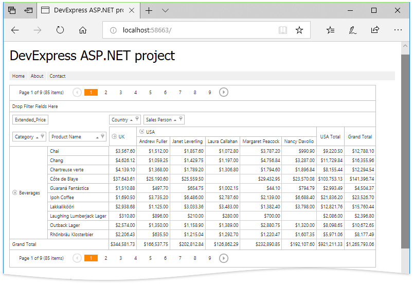

<!-- default badges list -->

<!-- default badges end -->
# Getting Started - How to bind ASP.NET MVC PivotGrid to Microsoft SQL Server Database File
This example illustrates how to add the [ASP.NET MVC PivotGrid](https://docs.devexpress.com/AspNet/10689/asp.net-mvc-extensions/pivot-grid) extension to a Web application, bind the extension to a data source and map pivot grid fields to data fields. The data are obtained from the Microsoft SQL Server Database File created in Visual Studio Designer using the query shipped with project files.

